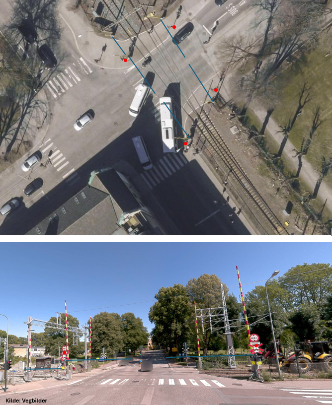
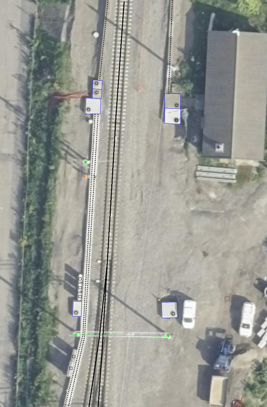

=== Spesielt om registrering av ledningsdata ved jernbane

Ved og langs jernbane kan det vært tett mellom de forskjellige ledningsobjektene. De etterfølgende bildeeksemplene prøver å presisere hva som skal registreres fotogrammetrisk og hvordan.

.Illustrasjon av planovergang langs jernbane og vanlige objekttyper. Blå linje viser Vegbom (registrert nedfelt) og rød punkt viser Mast med LEDNINGSNETTVERKSTYPE Signal.

.Illustrasjon av stasjonsområde langs jernbane og vanlige objekttyper. Blå strek viser Kum med LEDNINGSNETTVERKSTYPE ekom, svart sirkel viser Kumlokk med LEDNINGSNETTVERKSTYPE ekom, svart stiplet strek viser Kabelkanal med LEDNINGSNETTVERKSTYPE ekom, svart strek viser Spormidt, JERNBANETYPE J, svart firkant viser Skap med LEDNINGSNETTVERKSTYPE ukjent, grønn prikk viser Mast med LEDNINGSNETTVERKSTYPE kontaktledning, Oransje prikk viser Mast med LEDNINGSNETTVERKSTYPE signal og grønn strek viser Åk med LEDNINGSNETTVERKSTYPE kontaktledning.

